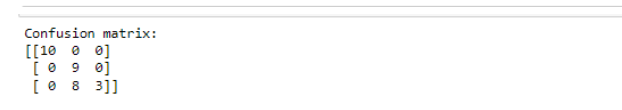

# SGD-Classifier
## AIM:
To write a program to predict the type of species of the Iris flower using the SGD Classifier.

## Equipments Required:
1. Hardware – PCs
2. Anaconda – Python 3.7 Installation / Jupyter notebook

## Algorithm
```
step 1:Start
step 2:Import Necessary Libraries and Load Data
step 3.Split Dataset into Training and Testing Sets
step 4:Train the Model Using Stochastic Gradient Descent (SGD)
step 5:Make Predictions and Evaluate Accuracy
step 6:Generate Confusion Matrix
step 7:End
```

## Program:
```
/*
Program to implement the prediction of iris species using SGD Classifier.
Developed by: BHAVATHARANI S
RegisterNumber:  212223230032
*/

import pandas as pd
from sklearn.datasets import load_iris
from sklearn.linear_model import SGDClassifier
from sklearn.model_selection import train_test_split
from sklearn.metrics import accuracy_score,confusion_matrix
import matplotlib.pyplot as plt
import seaborn as sns
#LOAD THE IRIS DATASET
iris = load_iris()
#creat a pandas dataframes
df= pd.DataFrame(data = iris.data,columns = iris.feature_names)
df['target'] = iris.target
#display the few rows of the dataset
print(df.head())
#split the data into features (x) and target(y)
X = df.drop('target', axis = 1)
y = df['target']
#split the
X_train,X_test,Y_train,Y_test = train_test_split(X,y,test_size = 0.2,random_state = 42)
#Create an SGD classifier with defualt parameters
sgd_clf = SGDClassifier(max_iter = 1000,tol = 1e-3)
#train the classifier on training data
sgd_clf.fit(X_train,Y_train)
#make predictions on testing data
y_pred = sgd_clf.predict(X_test)
#evaluate the classifier accuracy
accuracy = accuracy_score(Y_test,y_pred)
print(f"Accuracy: {accuracy:.3f}")
#calculate the confusion matrix
cm = confusion_matrix(Y_test,y_pred)
print("Confusion matrix:")
print(cm)
```

## Output:
```
x-value
```

```
y-value
```

```
confusion matrix
```



## Result:
Thus, the program to implement the prediction of the Iris species using SGD Classifier is written and verified using Python programming.
